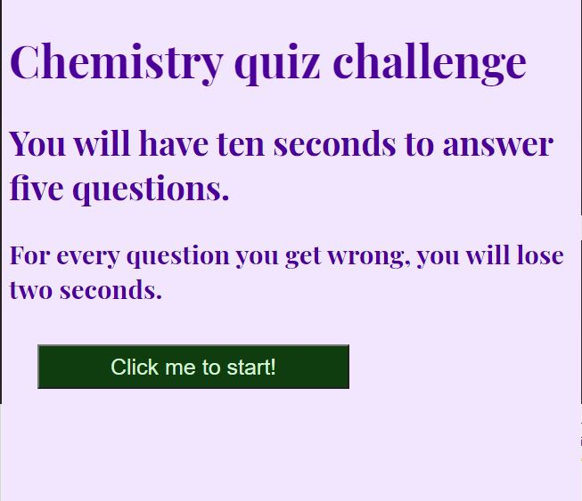
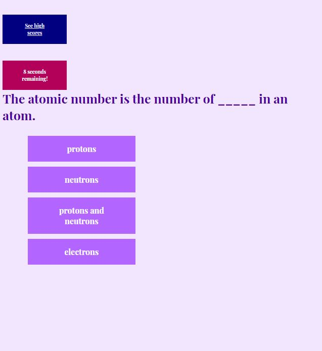
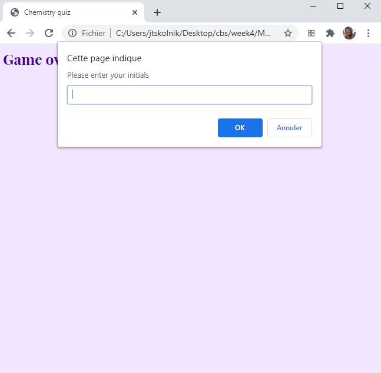
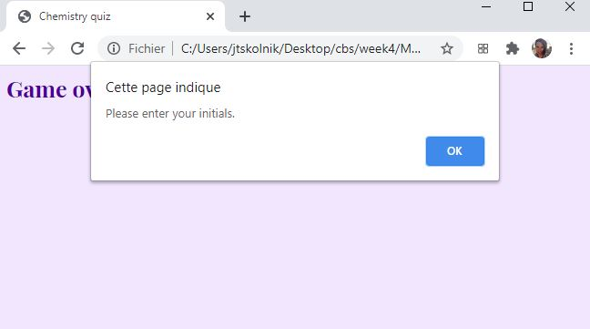
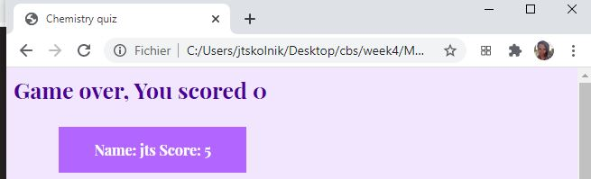

# Meower

## Overview

In this program, students will be greeted with a home page that tells them the rules of the quiz. Then they will take a five question quiz and they will learn if their selection was right or wrong. They will then be prompted to enter their initials to be put onto a score board. 

### Screenshots

Students are greeted with the following screen:

They then see a series of questions:

When they are done they are prompted for their initials:

If they do not enter initials an error message appears:

Then the high scores appear:

#### Development overview

1. Made a list of all of the questions, stored as object called questions

2. Took starter code from class and incorporated my questions into the code

3. We want the startup page to open in a new html file
    -made a new html file for the high scores and added link to original HTML file
    -created new js file and modified existing function to display high scores on a separate page

4. Added a CSS to style the html

5. Created a welcome screen with a button that redirects to the high scores

6. Added media queries to make the timer display and link to high scores page work better on small screens 

7. Added an if statement such that if a user submits a non-initials answer an error message appears
